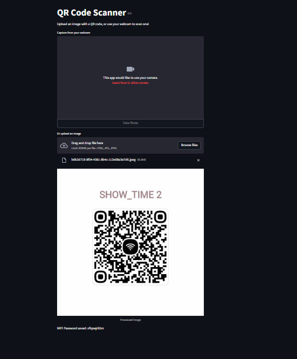

# Automatic QR Code Scanner with Streamlit

This repository contains a **Streamlit**-based application for scanning and processing QR codes in real time using a webcam. The application uses **OpenCV** and **Pyzbar** to detect QR codes and extracts the encoded data, saving it to a file named `scanned.txt`.

---



## Features

- **Automatic Detection**: Continuously scans video frames from the webcam for QR codes.
- **Real-Time Feedback**: Displays the scanned QR code data dynamically on the web interface.
- **Data Storage**: Saves the extracted QR code data to a text file (`scanned.txt`) automatically.
- **Simple Interface**: User-friendly design with live updates via Streamlit.

---

## Installation

### Prerequisites
- Python 3.7 or later
- Webcam-enabled device

### Install Dependencies
1. Clone the repository:
   ```bash
   git clone https://github.com/yourusername/automatic-qr-code-scanner.git
   cd automatic-qr-code-scanner
    ```

## Usage

1. Run the Streamlit application:
   ```bash
   streamlit run app.py
   ```
### How to Use:
- Ensure your webcam is enabled.
- Hold a QR code in front of the camera.
- The app will automatically detect the QR code, display its content, and save it to `scanned.txt`.
- Press **Ctrl + C** in the terminal to stop the application.
